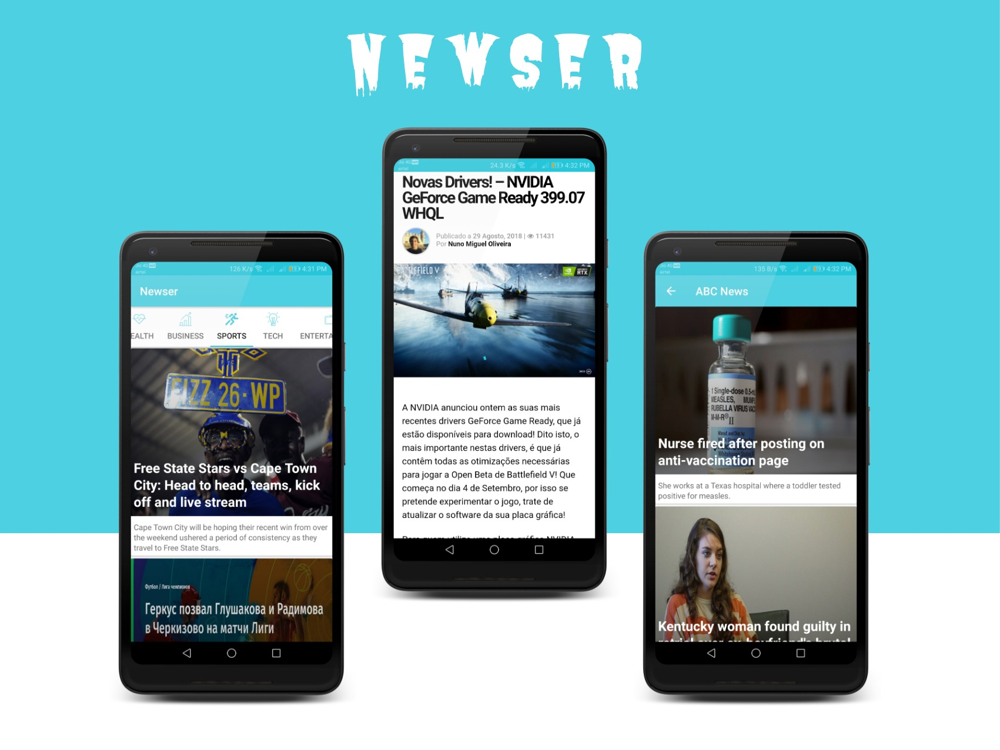
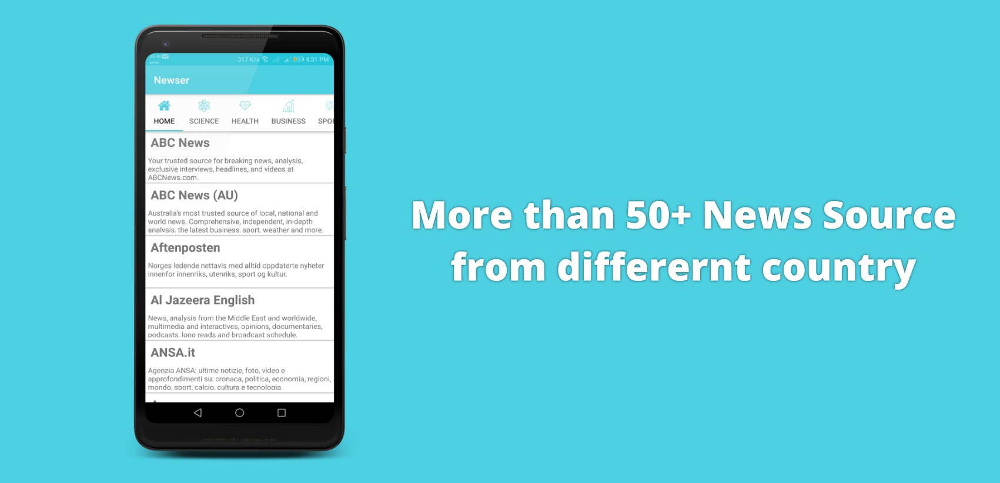
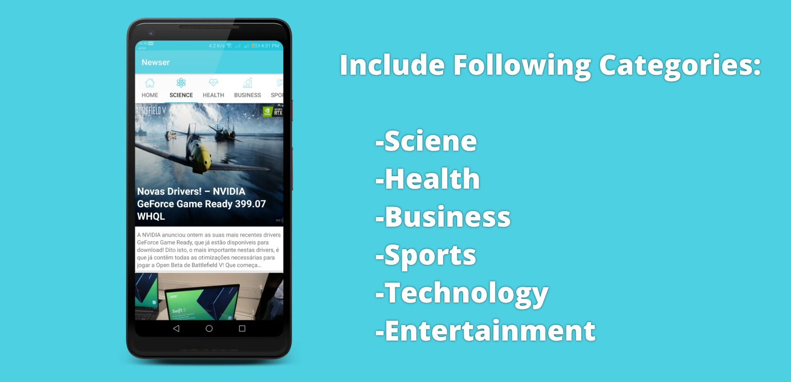

# Newser

# Description

A News Android application made using MVP architecture and  shows news from different sources. It uses newsAPI to show news from more than 50+ sources and from
different countries. Application also allows user to view news category wise. The application allows user to view top headlines
of particular category.

# Libraries Used

  * ButterKnife
  * Volley ( For Networking )
  * Picasso
  
# Architecture  

Model View Presenter (MVP) is followed in the applciation where no view is directly comunicating with model for data.
Presenter are made to act as intermediator between view and model.
It is made sure that the presenter doesn't have any dependency on android framework.
Since the View and the Presenter work closely together, they need to have a reference to one another.    
To make the Presenter unit testable with JUnit, the View is abstracted and an interface for it used.
The relationship between the Presenter and its corresponding View is defined in a Contract interface class, making the code more readable and the connection between the two easier to understand.
 

Here are the roles of every component:

 

 * Model — the data layer. Responsible for handling the business logic and communication with the network and database layers.
 * View — the UI layer. Displays the data and notifies the Presenter about user actions.
 * Presenter — retrieves the data from the Model, applies the UI logic and manages the state of the View, decides what to display and reacts to user input notifications from the View.

  
  

# Working

The application is divided in two parts :  
   1. News by News Source Name
   2. News by Category
   
In whole application the reusability is shown by using only one fragment everywhere.
The user can see news either by selecting news source or by selecting following category :  
   
   * Science
   * Business
   * Health
   * Entertainment
   * Technology
   * Sports

The query is made through volley library and the newsAPI return JSON which is parsed and selected field are retrieved and converted
into POJO. The total result limit is set to default(20) so a user can see only 20 news at a time under particular category or news
source. Once a user select the news the complete news site shows inside application using web view. 

 
 

# Contribute

Feel free to fork this project, and add new feature and design.
 
Then make a merge-request after updated the README with a sample of your design, include all screenshot and try to go with this color palette only.

#  Acknowledgement

  * NickleFox for whom I made the app.
  * [NewsAPI](www.newsapi.org)
  

